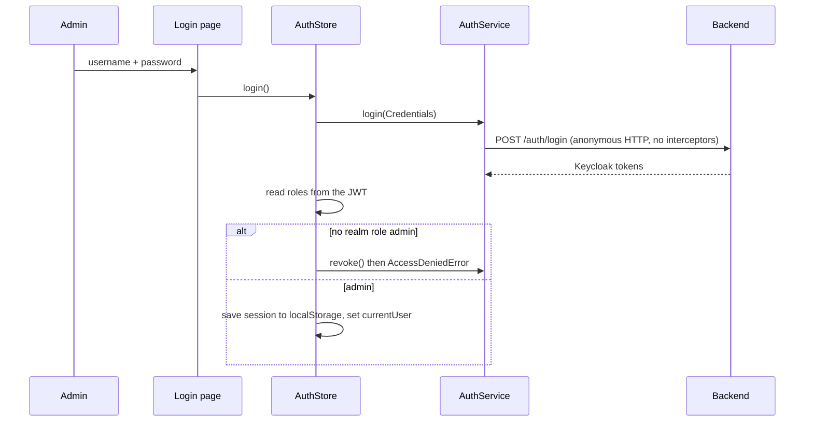

# Onboarding: how the Tofan admin panel works

Read this first. It explains the flows end to end. The rules live in `CLAUDE.md`, the reasons in
`docs/architecture.md`, and the per-screen details in `docs/modules/<feature>.md`.

## 1. What this app is

An Angular 22 admin panel for the Tofan fitness ecosystem: catalogs (exercises, foods, media files),
NFC garments, users (soldiers, accounts, sessions) and push notifications. It has no business logic
of its own. The .NET backend (separate repository) owns every rule; the panel validates only for UX.

The panel never talks to Keycloak. Identity goes Angular → .NET API → Keycloak.

## 2. First run

```bash
npm install
npm start               # /api is proxied to http://localhost:5179 (proxy.conf.json)
npm run start:staging   # /api is proxied to the staging API (proxy.staging.conf.json)
```

There is no mock backend. Signing in needs a Keycloak account with the realm role `admin`.
After every task run `npm run lint`, `npm test`, `npm run build`.

## 3. Folder map

```text
src/app/
  core/       one-per-app singletons: auth, http, layout, config, feedback, i18n
  shared/     business-agnostic: components, models, utils
  features/   one lazy folder per screen group
  routes/     app.routes.ts (top-level table, loadChildren only)
  app.config.ts   providers: router, HTTP, UI, i18n
```

Dependency direction (enforced by Sheriff, `npm run lint:boundaries`):

| Folder | May import | Must not import |
|---|---|---|
| core | other core, shared | features |
| shared | shared, `core/http`, `core/feedback`, `core/i18n` | features, other core |
| features/x | core, shared, own files | other features |

Features are removable: deleting `features/x` breaks only its route entry and menu item.

## 4. Startup and routing

1. `main.ts` boots `app.ts` with `app.config.ts`: router (with component input binding), `provideHttp`
   (interceptors), `provideUi` (Optimus UI theme) and `provideI18n` (Optimus translations follow the locale).
2. `routes/app.routes.ts` has three groups:
   - `''` renders the `Layout` shell (sidebar, topbar) behind `authGuard`; its children lazy-load
     `dashboard`, `exercises`, `foods`, `media`, `soldiers`, `accounts`, `garments`, `user-sessions`,
     `notifications`.
   - `auth` (login, access denied, error) and `not-found`, outside the shell.
   - `**` redirects to `not-found`.
3. Every feature has its own `<feature>.routes.ts` and sets titles with `pageTitle('layout.titles.x')`,
   translated by `AppTitleStrategy`.
4. Paths live in `core/config/app-paths.ts`, sidebar entries in `core/layout/menu/app-menu.ts`.

## 5. Authentication flow (`core/auth`)



Pieces:

- `AuthSession` holds the access token, its expiry and the refresh token. `isUsable()` is true when the
  access token is valid or can still be renewed.
- `AuthSessionStorage` keeps the session in `localStorage`; `AuthStore` is the only place that reads it.
  `AuthStore` is a root signal store: `currentUser()`, `displayName()`, `isAdmin()`, `hasSession()`.
- `authGuard`: no usable session → `/auth/login?returnUrl=...`; session without `admin` → `/auth/access-denied`.
  `guestGuard` keeps signed-in users away from the login page.
- Tokens and claims are read only in `core/auth` (`jwt.ts`, `auth.mapper.ts`).

Per-request behaviour (interceptors, order `sessionInterceptor`, then `authTokenInterceptor`):

```text
request ──> authTokenInterceptor: adds "Authorization: Bearer <token>" only for API_BASE_URL URLs
        <── sessionInterceptor:
              403           -> navigate to /auth/access-denied
              401 + session -> AuthStore.renewSession() (one shared refresh at a time, POST /auth/refresh)
                               -> retry the request once
                               -> refresh fails -> logout() and go to /auth/login
```

Logout calls `POST /auth/logout` and clears the session even if the backend is unreachable.

## 6. The data flow of every screen

```text
Page (routed component)
  └─ provides its own Store          providers: [ExercisesStore]
       └─ Store (signals)            state, loading, errors, applies model rules
            └─ Service               HTTP for one resource, DTO <-> model via the mapper
                 └─ ApiClient        get/post/put/delete, unwraps the Result envelope, maps errors
                      └─ Backend
```

Worked example, the exercises list (`features/exercises`):

1. `ExercisesPage` provides `ExercisesStore` and renders `app-data-table` (a lazy Optimus `p-table`).
2. The table emits `pageChange` (page, size, sort). The page calls `store.load(request)`.
3. The store sets `loading`, calls `ExercisesService.list(filter, request)`, stores the `Page<Exercise>`,
   or on failure keeps an empty page and `loadError` (a translatable message).
4. The service builds the query (`toPagedQuery` from `core/http/paging.mapper.ts` plus the filter),
   calls `ApiClient.get`, and maps each `ExerciseResponse` DTO to an `Exercise` model with `toExercise`.
5. Filters (`exercise-filters`) emit a filter; `store.applyFilter` goes back to page one.
6. Create/edit: `exercise-form-dialog` emits a draft; `store.save` runs `createExerciseDraft` (model
   rules), calls `create` or `update`, toasts through `NotificationService`, reloads, returns a boolean so
   the page can close the dialog.
7. Delete: the page asks `ConfirmDialogService`, then `store.remove`.

Layers inside a feature:

| Part | Where | Role |
|---|---|---|
| Model, filter, draft, labels, pure rules | `models/` | what the UI needs; unit-tested |
| DTO | `services/*.dto.ts` | exact backend shape |
| Mapper | `services/*.mapper.ts` | DTO ↔ model, integer enums via `shared/utils/enum-map.ts` |
| Service | `services/*.service.ts` | the only place that knows URLs for this resource |
| Store | `<feature>.store.ts` | signals + methods for one screen |
| Page / components | `pages/`, `components/` | presentation, calls the store |

Rule of thumb: components never inject services that do HTTP; templates never map or compute rules.

## 7. HTTP and error handling (`core/http`, `core/feedback`)

- `ApiClient` is the only HTTP entry point for services. URLs are built from the `API_BASE_URL` token
  (`/api`, resolved by the dev proxy or the production nginx). `postAnonymously` skips interceptors
  (login and refresh). `download` returns a `DownloadedFile` for Excel exports.
- The backend answers with a `Result` envelope or ProblemDetails. `unwrapResult` returns `data` or
  throws; `api-error.mapper.ts` converts both shapes to error classes in `shared/models/errors`
  (`ValidationError`, `NotFoundError`, `ConflictError`, `BusinessRuleError`, `AccessDeniedError`,
  `ServiceUnavailableError`) plus `SessionExpiredError`. Each carries the backend `code`.
- Code branches on the class or `code`, never on message text.
- User text comes from `core/feedback/error-message.ts` (`toErrorMessage`): a per-code translation key
  if known, otherwise a generic one per error class. Stores put it in `loadError`; actions call
  `notifications.error(error)`.
- Toasts and confirmations: `NotificationService`, `ConfirmDialogService`. Never `MessageService` directly.

## 8. Internationalization (`core/i18n`)

Uzbek (default), Russian, English. The choice is a `LocaleStore` signal persisted in `localStorage`
(`tofan.locale`) and mirrored to `<html lang>`.

- Every UI string is a typed key in `translations/uz|ru|en`; a missing translation breaks the build.
- Templates: `{{ 'media.page.title' | t }}`. Code: `Translator.translate(key, params)`.
- Backend catalog data carries three language fields; `pickLocalized(names, locale)` chooses one.
  Sorting by name uses the column of the current language.
- Dates use `core/i18n/date-format.ts`. Details and traps: `docs/modules/i18n.md`.

## 9. Layout and theme (`core/layout`)

`Layout` hosts the sidebar (menu from `app-menu.ts`), topbar (logo, language and theme switchers, sign out)
and the router outlet. The dashboard greets the admin by `AuthStore.displayName()`. Theme tokens come from the Optimus preset (`core/layout/theme`); styles
use tokens and Tailwind utilities, no inline colours. Optimus components are imported one by one from
`@openng/optimus-ui/<component>`, never from a barrel.

## 10. Shared building blocks (`shared/components`)

| Component | Use |
|---|---|
| `data-table` | server-paged, sortable list; `pageChange` → store; error and retry built in |
| `form-dialog` | dialog shell for create/edit forms |
| `text-field`, `select-field`, `number-field`, `date-field`, `choice-field`, `color-field` | Signal Forms wrappers over Optimus inputs |
| `localized-text-field` | three-language text input |
| `file-upload` | uploads with progress (the one component that may do HTTP, through its service) |
| `field-error` | shows form validation messages |

## 11. Features at a glance

| Feature | Route | Backend base | What the admin does |
|---|---|---|---|
| dashboard | `/` | none | welcome page |
| exercises | `/exercises` | `/exercises` | exercise catalog in 3 languages, video, activate, delete |
| foods | `/foods` | `/diet/foods` | food catalog, search by barcode, create/edit/delete |
| media | `/media` | `/files` | browse, preview, upload and delete stored files |
| garments | `/garments` | `/admin/garments` | NFC garments: create (server-made ULID serial), status, extend, export chip links |
| soldiers | `/soldiers` | `/admin/soldiers` | read-only user cards with weight chart |
| accounts | `/accounts` | `/admin/users` | Keycloak accounts: roles, block/unblock, sign out everywhere |
| user-sessions | `/user-sessions` | `/user-sessions` | read-only login journal |
| notifications | `/notifications/templates`, `/notifications/send` | `/notification-templates`, `/notifications` | manage push templates, send a push to one user |
| auth | `/auth/*` | `/auth/*` | login, access denied, error pages |
| not-found | `/not-found` | none | 404 |

Details per feature: `docs/modules/<feature>.md`. Backend contract: `docs/backend-contract.md`.

## 12. Production

Docker builds the panel and serves it from nginx on port 8080. The same image runs everywhere; nginx
proxies `/api/*` to `API_UPSTREAM` with the prefix stripped, so the browser sees one origin and no
CORS is needed. `index.html` is `no-cache`, hashed assets are immutable. Details: `docs/deployment.md`.

## 13. How to add things

- New screen group: skill `new-feature`. Register it in `routes/app.routes.ts`, `core/config/app-paths.ts`
  and `core/layout/menu/app-menu.ts`.
- List plus create/edit screen: skill `crud-page`; the reference feature is `features/exercises`, and
  `features/garments` is the reference for Signal Forms.
- Tests: Vitest, next to the file, named `should <result> when <condition>`. Store tests mock the
  feature service, never `HttpClient`.
- No comments in project files, no `any`, no UI text outside i18n keys. `npm run lint` enforces most of it.

## 14. Navigating the code quickly

- `ast-index search|class|symbol|usages "<name>"` for symbols and references.
- `graphify query "<question>"`, `graphify path "A" "B"`, `graphify explain "X"` for relationships;
  run `graphify update .` after code changes.
- Both are wired into `.claude/settings.json` hooks for Claude Code sessions.
